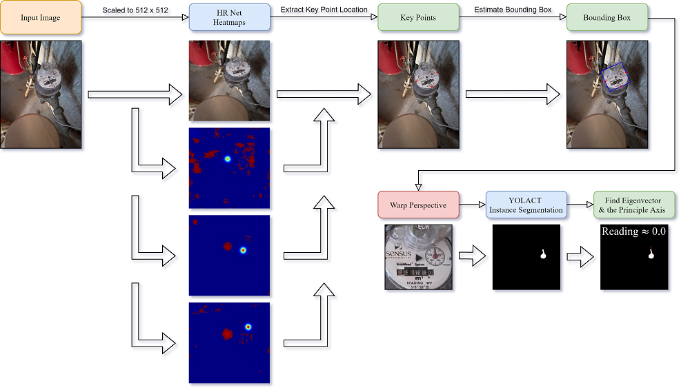

Improved Water-Meter-Monitor
===================
## 1. Overview
This project improves upon the original [Water Meter Monitor](https://github.com/Tom2096/Water-Meter-Monitor) by taking advantage of several **Deep Learning Neural Networks**. The original project demands the position and perspective of the odometer to be fixed in every snapshot as the x-axis and y-axis are manaully plotted at the begining. This issue is now resolved by training [HRNet](https://github.com/leoxiaobin/deep-high-resolution-net.pytorch) to localize three key points of the odometer and perform perspective correction. The latest approach also uses [YOLACT](https://github.com/dbolya/yolact) to extract the target mask through instance segmentation instead of HSV color filtering to enhance the accuaracy of the pipeline.

## 2. Pipeline

**The pipeline consists of**
- **Key Point Localization through HRNet**
- **Bounding Box Estimation and Perspective Correction**
- **Instance Segmention through YOLACT**
- **Eigenvectors & Principle Axis**

## 2.1 Key Point Locatization ##

Then, three points (in red) pinpointing the center, the y-axis, and the x-axis are manually plotted. These points will be used as a frame for all future pictures. 

The vertices of the box bounding the odometer is then created by adding and subtracting the length of the x-axis and y-axis. 

Then, the picture is read and converted into HSV color format to filter out the red arm of the odometer. 

The image is then denoised by first eroding to rid the image of outlying pixels, then dilating to fill in any holes in the middle. Finally, the image is eroded again to trim the edges. 

The eigenvalues and right eigenvectors are then computed to determine the direction of the arm

The eigenvector corresponding  with the largest eigenvalue is then projected onto the x and y axis, which can be calculated to give the angle of rotation and the odometer reading.   

