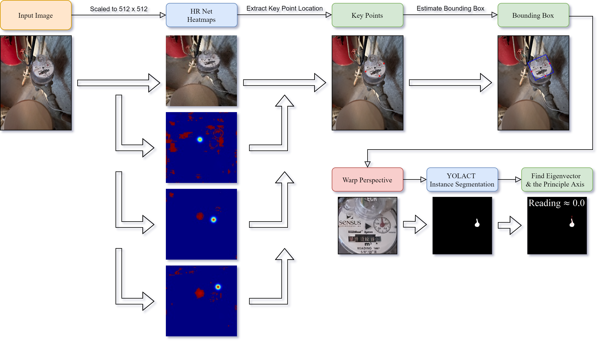
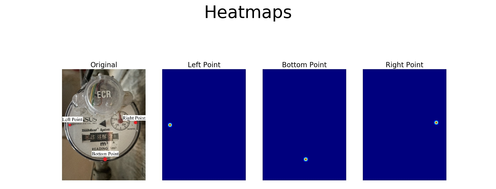

Improved Water-Meter-Monitor
===================
## 1. Overview
This project improves upon the original [Water Meter Monitor](https://github.com/Tom2096/Water-Meter-Monitor) by taking advantage of several **Deep Learning Neural Networks**. The original project demands the position and perspective of the odometer to be fixed in every snapshot as the x-axis and y-axis are manaully plotted at the begining. This issue is now resolved by training [HRNet](https://github.com/leoxiaobin/deep-high-resolution-net.pytorch) to localize three key points of the odometer and perform perspective correction. The latest approach also uses [YOLACT](https://github.com/dbolya/yolact) to extract the target mask through instance segmentation instead of HSV color filtering to enhance the accuaracy of the pipeline.

## 2. Pipeline

**The pipeline consists of**
- **Key Point Localization through HRNet**
- **Bounding Box Estimation and Perspective Correction**
- **Instance Segmention through YOLACT**
- **Finding the Eigenvectors & Principle Axis**

## 2.1 Key Point Locatization ##

The three key points are defined as the three screws on the odometer. The gaussian ground truth heatmaps shown above are generated as per methods desribed on the official [HRNet Github Page](https://github.com/leoxiaobin/deep-high-resolution-net.pytorch). MSE Loss is used to sum the differences between the heatmaps produced by the model and the ground truths, and is minimizaed to optimize the model parameters.   

## 2.2 Perspective Correction ##

A rectangular bounding box is constructed by estimating the likely intersections between the three located key points. Then, the four vertices of the bounding box are used to perform **OpenCV's WarpPerspective** to crop and correct the perspective of the odometer. 

## 2.3 Instance Segmention ##

YOLACT is used to perform instance segmentation on the warped image, which extracts the mask of the red pointer. The previous method was to use HSV color filtering, but that approach proved unrelible when lighting conditions are not ideal. The training dataset is annotated through [Labelme](https://github.com/wkentaro/labelme), and is converted into COCO styled annotations for YOLACT.

## 2.4 Obtaining the Result ##

Once we obtain the mask of the pointer, we determine the eigenvector and the principle axis to find the direction of the arm. 

## 3. Links to Pretrained Models and Datasets ##

The following are links to the trained models and datasets used in this project:
- Dataset for HRNet
- Dataset for YOLACT
- Initization Weights for HRNet
- Final Trained Weights 

